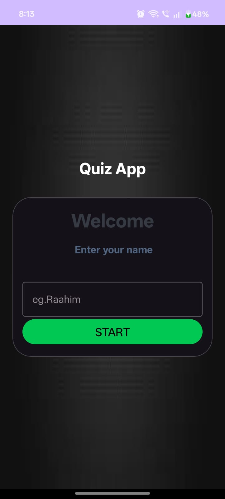
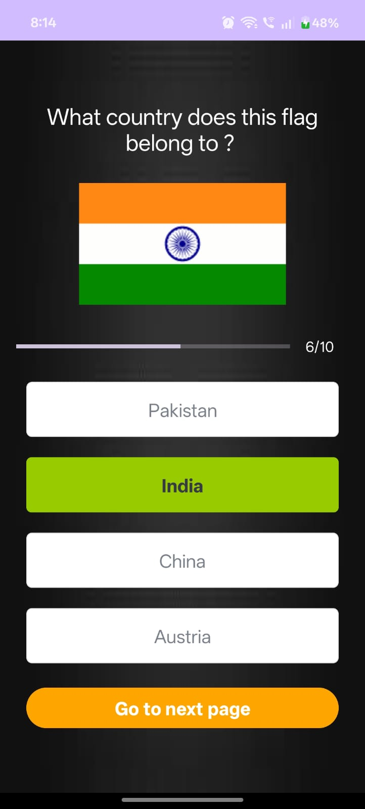
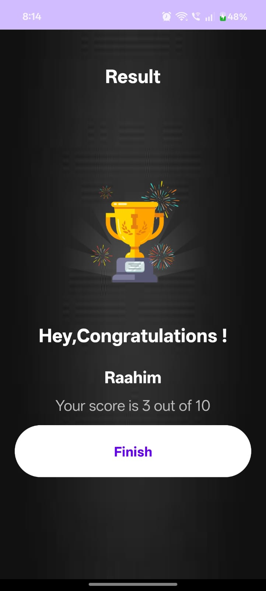

# MyQuizApp 🎯

**MyQuizApp** is a fun and interactive **multiple-choice quiz application** built in Android Studio using **Kotlin** and **XML**.  
This version features a *Guess the Country Flag* quiz with **10 questions**, showing results based on your correct answers.

---

## 📱 App Preview

| Home Screen | Quiz Screen | Result Screen |
|------------|------------|---------------|
|  |  |  |


---

## 🚀 Features

- 🎌 Guess the **country by its flag**
- ✨ Clean and modern UI
- 🎯 Score calculation at the end
- 🧠 10-question quiz format
- 💾 Uses **SharedPreferences** to store player name
- 📴 Works **offline** — no internet required

---

## 🛠️ Tech Stack

| Technology | Used For |
|-----------|----------|
| **Kotlin** | App Logic & Programming |
| **XML Layouts** | UI Design |
| **SharedPreferences** | Saving User Name |
| **Android Studio** | Development Environment |

---

## 🎨 App Logo

<p align="center">
  
</p>

(Add the logo to your repository root as **app_logo.png** for this to display.)

---

## 📦 How to Run the App

1. Clone this repository:
   ```bash
   git clone https://github.com/raahimkhan18/QuizApp.git
